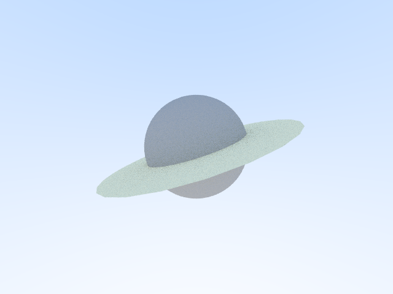
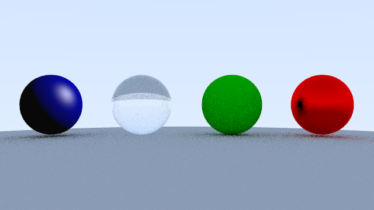

# raytracer

Implements a raytracer based on the book [_Ray Tracing in One Weekend_](https://raytracing.github.io/books/RayTracingInOneWeekend.html). 

## How to build

*Windows*

Open git bash to the directory containing this repository.

```
raytracer $ mkdir build
raytracer $ cd build
raytracer/build $ cmake -G "Visual Studio 16 2019" ..
raytracer/build $ start CS312-Raytracer.sln
```

Your solution file should contain multiple projects, such as `gradient` and `normals`.
To run from the git bash command shell, 

```
raytracer/build $ ../bin/Debug/gradient
raytracer/build $ ../bin/Debug/normals
```

*macOS*

Open terminal to the directory containing this repository.

```
raytracer $ mkdir build
raytracer $ cd build
raytracer/build $ cmake ..
raytracer/build $ make
```

To run each program from build, you would type

```
raytracer/build $ ../bin/gradient
raytracer/build $ ../bin/normals
```

## Supported features

### Required primitives

*Sphere*: specified by a center *c* and a radius *r*. Example Planet.png.



*Plane*: specified by a point *p* and a normal *n*. The direction of the outwards normal follows the right-hand rule and it always points left or outside the screen. Example: Room.png.


*Triangle*: specified by three vertices $a$, $b$, $c$. Its outwards normal follows the right-hand rule and it always points left or outisde the screen. Example: Tetrahedron.png, Planet.png (the ring is made by drawing a collection of triangles).


### Custom primitives

*Line segment*: specified by two endpoints $a$ and $b$. Its outwards normal always points left or outside the screen (by taking the cross product with *(0,0,1)*). This primitive cannot be captured in an image alone, but it contributes to other primitives such as triangles, etc.

*Circle*: specified by a center, a radius, and a normal. This is done by dividing a circle on xy-plane into pieces of triangles and applying the transformation matrices.

### Required materials

*Lambertian*: specified by a base color *albedo*.

*Phong*: specified by a *diffuseColor*, a *specColor*, an *ambientColor*, a *lightPos*, a *viewPos*, three coefficients *kd*, *ks*, *ka*, and a *shininess index*.

*Metal*: specified by a base color *albedo* and a *fuzz index*.

*dieletric*: specified by an *index of refraction*.



### Custom features

*Positionable Camera*: Allowing different positioning and orienting of the camera. It is also able to zoom in/out a scene. Example: the space station series.

*Defocus Blur*: Allowing "defocus blur"/"depth of field" effect of an image. Example: the space station series.

*3D transformations*: Allowing 3d transformations such as rotations, translations, etc. to points and vectors. Example: Planet.png. 


## Results

*The Space Station Series*

This series of images are produced by applying all supported features. The walls are made using plane primitive and phong material, except that the one in the center is made in glass/dieletric. The tetrahedron is made using triangle/line primitive(s) and metal material. The planets are made using sphere primitives and lambertian material. The ring is made by circle/triangle primitives and lambertian material. 


The subsequent images are taken with different angles, zoom-in effect, and deefocus blur effect.


.png)


 


